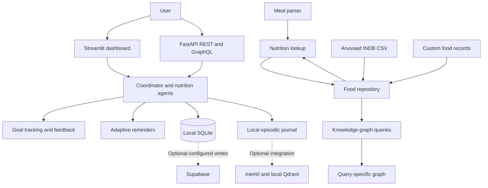

# MacroTrack

MacroTrack is a nutrition-tracking application focused on Indian foods and meals. It combines a Streamlit dashboard, a FastAPI REST and GraphQL API, meal parsing and nutrition lookup agents, daily and weekly goal tracking, adaptive reminders, and a query-driven nutrition knowledge graph.

The official food reference is the Anuvaad Indian Nutritional Database (INDB) dataset included in this repository. Users can also create personal foods and meals with manually entered nutrition values. Custom foods are persisted locally and appear alongside official foods in search and applicable knowledge-graph queries.

## Contents

- [Capabilities](#capabilities)
- [Architecture](#architecture)
- [Food data and nutrition rules](#food-data-and-nutrition-rules)
- [Requirements and installation](#requirements-and-installation)
- [Configuration](#configuration)
- [Run MacroTrack](#run-macrotrack)
- [Create a custom food or meal](#create-a-custom-food-or-meal)
- [REST API](#rest-api)
- [GraphQL API](#graphql-api)
- [Storage and privacy](#storage-and-privacy)
- [Tests](#tests)
- [Project layout](#project-layout)
- [Known boundaries](#known-boundaries)

## Capabilities

- Log meals using text, a plate photo, or a packaged-food nutrition-label image. Gemini-powered image and text parsing is available when configured; a rule-based text parser is used as a fallback.
- Look up official foods in the included Anuvaad INDB dataset and calculate nutrition from its per-100-gram values.
- Create custom foods or complete meals by entering nutrition values yourself. These values are kept as entered and are not replaced with estimates from INDB.
- Search official and custom foods from the dashboard's food database browser.
- Track meal logs against daily calorie and macronutrient goals, view weekly summaries, and calculate suggested targets from profile information.
- Adjust subsequent meal reminders based on logged meal timing and export schedules as an `.ics` calendar file.
- Ask natural-language food and nutrient questions in the knowledge-graph explorer, which presents query results and a graph visualization.
- Use the same core capabilities through REST endpoints and selected GraphQL operations.

## Architecture



The main components are:

| Component | Responsibility |
| --- | --- |
| Meal parser | Converts text or image input into candidate food names, quantities, and units. |
| Food repository | Loads and searches the official dataset and persisted custom foods. |
| Nutrition lookup | Resolves food names and calculates nutrition using the matched food's source and serving basis. |
| Coordinator | Orchestrates parsing, lookup, meal logging, memory, goal tracking, feedback, reminders, and food pathways. |
| Goal tracker and feedback agent | Calculates intake status, suggests goal targets, and produces meal or weekly feedback. |
| Reminder agent | Maintains a meal schedule, adapts it to logged meal times, and generates calendar output. |
| Knowledge-graph agent | Interprets food/nutrient questions, selects relevant records, and creates query-specific graph results. |
| Persistence layer | Uses SQLite for application data and a local JSON journal for episodic history; optional integrations can be configured. |

## Food data and nutrition rules

### Official Anuvaad INDB foods

The read-only CSV at [data/Anuvaad_INDB_2024.11.csv](data/Anuvaad_INDB_2024.11.csv) contains 1,014 foods and recipes. The loader maps fields including energy, protein, carbohydrates, fat, fiber, calcium, iron, sodium, potassium, vitamin C, and free sugar into the application's food model.

Official nutrition values are represented per 100 g. When a food cannot be reliably matched, the application does not invent nutrition values. A query can return a not-found result or ask the user to resolve an ambiguous match. Meal logging rejects unresolved or ambiguous items rather than logging them as verified foods.

### Custom foods and meals

Custom records are different from official dataset records:

- The user supplies the name, optional description, nutrition basis, serving details, and nutrition values.
- The description is searchable context only. MacroTrack does not decompose its ingredient list into INDB foods or look up those ingredients.
- The values the user enters are the source of truth for that custom record.
- Custom foods are stored in the local `custom_foods` table and are included in the food-search experience. Matching custom foods can also be returned by knowledge-graph queries.
- The UI distinguishes custom records from INDB records in search results.

For a per-serving entry, provide nutrition for the serving described by `serving_name`. For a per-100-g entry, provide values on a 100 g basis. Use serving metadata consistently, especially when the serving size represents a gram weight.

## Requirements and installation

The Docker image uses Python 3.11. A local Python 3.11+ installation is recommended. The steps below use a virtual environment so dependencies stay isolated.

### Windows PowerShell

```powershell
py -3.11 -m venv .venv
.\.venv\Scripts\Activate.ps1
python -m pip install --upgrade pip
pip install -r requirements.txt
```

If PowerShell blocks activation scripts, use the environment's interpreter directly instead:

```powershell
.\.venv\Scripts\python.exe -m pip install -r requirements.txt
```

### macOS or Linux

```bash
python3 -m venv .venv
source .venv/bin/activate
python -m pip install --upgrade pip
pip install -r requirements.txt
```

## Configuration

MacroTrack loads a `.env` file from the project root when present. Most integrations are optional; the application can use its local data and heuristic text parser without Gemini credentials.

| Variable | Purpose | Default |
| --- | --- | --- |
| `GOOGLE_API_KEY` | Enables Gemini-backed meal parsing and configures the Gemini provider used by episodic memory when available. | Empty |
| `GEMINI_MODEL` | Gemini model name used by the meal parser. | `gemini-3.5-flash` |
| `SUPABASE_URL` | Optional Supabase project URL. | Empty |
| `SUPABASE_KEY` | Optional Supabase key. | Empty |
| `HOST` | API bind address. | `0.0.0.0` |
| `PORT` | API port. | `8000` |

Example `.env` for local use with Gemini:

```dotenv
GOOGLE_API_KEY=your_google_api_key
GEMINI_MODEL=gemini-3.5-flash
HOST=0.0.0.0
PORT=8000
```

Do not commit real credentials. If `GOOGLE_API_KEY` is absent or Gemini initialization fails, the meal parser falls back to its heuristic text parser; image understanding requires a functioning Gemini configuration.

## Run MacroTrack

### Streamlit dashboard

From the project root, run either:

```bash
streamlit run streamlit_app.py
```

or:

```bash
python run_dashboard.py
```

The dashboard is organized into six tabs:

1. **Multimodal Meal Logger**: enter a meal, optionally attach a photo or label, review resolution status, and log verified foods.
2. **Daily & Weekly Intake**: review logged meals, goal progress, daily totals, and a weekly summary.
3. **Nutrition Knowledge Graph**: query foods or nutrient rankings and inspect result records and graph output.
4. **Adaptive Reminders**: review or simulate a schedule adjustment and download an `.ics` calendar file.
5. **Anuvaad Food Database**: search official foods and your custom foods; open the custom-food form to add a record.
6. **Profile & Goal Settings**: update profile attributes and set manual or calculated targets.

### REST and GraphQL API

Start the API with:

```bash
python run_server.py
```

The default server address is `http://localhost:8000`. Interactive REST documentation is at `http://localhost:8000/docs`; the GraphQL endpoint is `http://localhost:8000/graphql`.

### Docker

Build and run the Streamlit image from the project root:

```bash
docker build -t macrotrack .
docker run --rm -p 8501:8501 -p 8000:8000 macrotrack
```

The image's default command starts Streamlit on port `8501`. The API is a separate process; start it separately if you need both services in the same deployment. Mount a volume for persistent local database and memory files if container data must survive recreation.

## Create a custom food or meal

In the dashboard, open **Anuvaad Food Database**, choose **Add Custom Food / Meal**, and enter:

- A searchable food or meal name.
- An optional description, such as an ingredient list. This does not trigger ingredient-level INDB matching.
- Whether the nutrition values are for one serving or per 100 g.
- Serving size and a readable serving name.
- Calories, protein, carbohydrates, fat, fiber, sugar, and sodium.

Save the record, then search for its name in the same database browser. Custom foods can also be looked up through the food endpoints below. At least one nutrition value must be non-zero; values cannot be negative, and serving size must be positive.

## REST API

All application routes use the `/api` prefix. The following are commonly used endpoints; request and response schemas are also available in Swagger at `/docs`.

| Method | Endpoint | Purpose |
| --- | --- | --- |
| `POST` | `/api/meals/parse` | Parse meal text and return parsed items and nutrition totals without logging. |
| `POST` | `/api/meals/log` | Process and log a text meal. |
| `POST` | `/api/meals/log-image` | Process an uploaded image, optionally with text notes and packaged-label mode. |
| `GET` / `POST` | `/api/profile` | Read or update a user profile; profile updates can recalculate goals. |
| `GET` / `POST` | `/api/goals` | Read or update calorie and macro targets. |
| `GET` | `/api/summary/daily` | Return daily intake status and summary. |
| `GET` | `/api/summary/weekly` | Return weekly intake status and report. |
| `GET` | `/api/reminders/schedule` | Read a user's reminder schedule. |
| `POST` | `/api/reminders/adapt` | Apply a reminder adjustment for a logged meal time. |
| `GET` | `/api/reminders/calendar.ics` | Download the reminder schedule as an iCalendar file. |
| `POST` | `/api/knowledge-graph/query` | Answer a natural-language food or nutrient question. |
| `GET` | `/api/knowledge-graph/protein-density` | Return ranked protein-food results, optionally filtered by diet. |
| `GET` | `/api/knowledge-graph/schema?query=...` | Return query graph data; without a query, return an awaiting-query response. |
| `GET` | `/api/foods/search?query=...` | Search official and custom foods. Supports `limit` and `category`. |
| `GET` | `/api/foods/match?query=...` | Resolve a food name and report found, ambiguous, or not-found status. |
| `GET` / `POST` | `/api/foods/custom` | List a user's custom foods or create a custom food. |
| `DELETE` | `/api/foods/custom/{food_id}?user_id=...` | Delete a custom food for a user. |
| `POST` | `/api/memory/reset?user_id=...` | Clear that user's meal data and episodic memory. |
| `POST` | `/api/webhook/whatsapp` | Accept a WhatsApp-style inbound message payload and process it as a meal. |

Example custom-food request:

```bash
curl -X POST http://localhost:8000/api/foods/custom \
    -H "Content-Type: application/json" \
    -d '{
        "user_id": "default_user",
        "name": "My Morning Oats",
        "description": "Oats, whey, banana, and peanut butter",
        "nutrition_basis": "serving",
        "serving_size": 1,
        "serving_name": "1 bowl",
        "nutrition": {
            "calories": 650,
            "protein": 40,
            "carbohydrates": 75,
            "fat": 20,
            "fiber": 10,
            "sugar": 15,
            "sodium": 200
        }
    }'
```

The `nutrition_basis` field accepts `serving` or `100g`. Use `GET /api/foods/custom?user_id=default_user` to list a user's custom records.

## GraphQL API

The Strawberry GraphQL endpoint is mounted at `/graphql`. It currently exposes queries for `profile`, `goals`, `daily_status`, `protein_leaderboard`, and `food_search`, plus mutations for `log_meal_text`, `update_goals`, and `reset_user_memory`.

Example query:

```graphql
query {
    daily_status(userId: "default_user") {
        date
        mealCount
        consumedCalories
        consumedProtein
        remainingCalories
        remainingProtein
    }
}
```

GraphQL's interactive explorer is available at `/graphql` while the API server is running.

## Storage and privacy

- The local SQLite database is stored at `macrotrack_local.db` in the project root. It holds profiles, goals, meal logs, reminder schedules, and custom-food records.
- Episodic meal history is also written to `episodic_memory_store.json` in the project root. When available, the mem0 integration can additionally use local Qdrant data under `qdrant_mem0_data/`.
- Supabase can be configured with `SUPABASE_URL` and `SUPABASE_KEY`. The application still uses local SQLite storage; configure and validate the cloud schema and deployment behavior before relying on Supabase for production data.
- Avoid placing credentials in source control. Meal descriptions, images sent to Gemini, and stored nutrition records may contain personal information; configure API access and deployment storage accordingly.
- The dashboard's reset action and `POST /api/memory/reset` clear a user's meal data and episodic memory. Custom-food deletion is available separately through the custom-food API.

## Tests

Install project dependencies, then run the complete suite from the repository root:

```bash
python -m pytest tests/ -v
```

For the knowledge-graph and custom-food coverage specifically:

```bash
python -m pytest tests/test_kg_queries.py -q
```

The tests cover dataset loading and matching, nutrition calculations, meal parsing and logging, custom-food persistence and serving calculations, API routes, goal tracking, reminders, and knowledge-graph queries.

## Project layout

```text
macrotrack/
├── data/                         # Anuvaad CSV and related dataset assets
├── src/
│   ├── agents/                   # Parsing, lookup, goals, feedback, reminders, KG
│   ├── api/                      # FastAPI routes and GraphQL schema
│   ├── data/                     # Dataset loader, mapper, models, repository
│   ├── database/                 # SQLite/Supabase persistence layer
│   ├── graph/                    # Knowledge-graph construction
│   ├── memory/                   # Episodic memory integration
│   └── ui/                       # Streamlit dashboard
├── tests/                        # Agent, API, and KG tests
├── run_dashboard.py              # Dashboard launcher
├── run_server.py                 # API launcher
├── streamlit_app.py              # Streamlit entry point
├── requirements.txt              # Python dependencies
└── Dockerfile                    # Streamlit container image
```

## Known boundaries

- Food recognition and nutrient lookup are not a substitute for professional dietary or medical advice.
- Official INDB values apply to the dataset's food records and per-100-g basis. Custom records depend entirely on the accuracy and basis of the values entered by the user.
- The heuristic parser is intentionally limited; use explicit food names and quantities, and check the returned match before logging. Image and nutrition-label interpretation requires a working Gemini API configuration.
- The current application has no authentication layer. Do not expose the API or dashboard publicly with sensitive data until authentication, authorization, and deployment security controls are added.
