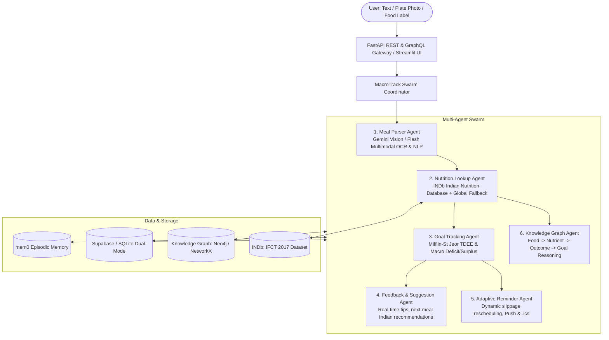

# MacroTrack: Multi-Agent Clinical Nutrition Tracking System

MacroTrack is a multimodal, multi-agent clinical nutrition tracking and coaching system specifically tailored for Indian diets, powered by **Gemini 3.5 Flash**, **mem0** episodic memory, **INDb** (Indian Food Composition Tables / ICMR-NIN), a **Nutrition Knowledge Graph**, adaptive reminders, and dual REST + GraphQL APIs.

---

## 🌟 Key Architecture & Capabilities



### 1. The 6 Specialized Agents
1. **Meal Parser Agent (`src/agents/meal_parser.py`)**:
   - Multimodal inputs: Text descriptions (*"2 chapatis with dal"*), Plate photos, and Packaged food labels (OCR).
   - Utilizes Gemini 3.5 Flash with structured output schemas and heuristic NLP fallbacks.
2. **Nutrition Lookup Agent (`src/agents/nutrition_lookup.py`)**:
   - Authoritative **INDb** (Indian Food Composition Tables / ICMR-NIN) dataset for 200+ Indian staples with exact macros and micronutrients (calcium, iron, fiber).
   - Fuzzy alias matching (e.g. *roti* $\rightarrow$ *chapati*, *dahi* $\rightarrow$ *curd*, *paneer bhurji* $\rightarrow$ *cottage cheese*).
3. **Goal Tracking Agent (`src/agents/goal_tracker.py`)**:
   - Clinical **Mifflin-St Jeor** BMR/TDEE auto-calculator tailored by user archetype (*Athlete*, *Weight Loss*, *General Health*).
   - Real-time and weekly drift analytics across Calories, Protein, Carbohydrates, and Fat.
4. **Feedback & Suggestion Agent (`src/agents/feedback_agent.py`)**:
   - Instant post-meal nutritional critiques and macro balance warnings.
   - Next-meal recommendations specifically curated from complementary Indian foods to close macro deficits.
5. **Adaptive Reminder Agent (`src/agents/reminder_agent.py`)**:
   - Customizable meal timing (3 to 6 meals/day).
   - **Dynamic Slippage Rescheduling**: If lunch is logged 2 hours late (e.g. 15:30 instead of 13:30), evening snack and dinner reminders automatically shift forward to prevent digestive indigestion and metabolic overlap.
   - Generates downloadable iCalendar (`.ics`) schedules and push notification JSON payloads.
6. **Knowledge Graph Agent (`src/agents/kg_agent.py`)**:
   - Multi-hop graph reasoning over **Food $\rightarrow$ Nutrient $\rightarrow$ Health Outcome $\rightarrow$ User Goal**.
   - Answers queries like: *"Which foods help me reach protein target fastest?"* by computing protein-to-calorie density scores.

---

## 🚀 Quick Start

### 1. Set Up Environment
Configure `.env` from `.env.example`:
```bash
cp .env.example .env
```
Ensure your `GOOGLE_API_KEY` is set.

### 2. Launch FastAPI Server (REST + GraphQL)
```bash
uvicorn src.api.app:app --host 0.0.0.0 --port 8000 --reload
```
- Interactive Swagger UI: `http://localhost:8000/docs`
- Interactive GraphQL Explorer: `http://localhost:8000/graphql`

### 3. Launch Streamlit UI
```bash
streamlit run src/ui/dashboard.py
```

### 4. Run Automated Tests
```bash
pytest tests/ -v
```

## ☁️ Host from GitHub

GitHub stores the source code, while **Streamlit Community Cloud** runs the Streamlit interface. GitHub Pages cannot run this Python application.

1. Create a new GitHub repository and push this project:
  ```bash
  git add .
  git commit -m "Initial MacroTrack release"
  git branch -M main
  git remote add origin https://github.com/<your-user>/<your-repo>.git
  git push -u origin main
  ```
2. Open [share.streamlit.io](https://share.streamlit.io), sign in with GitHub, and choose **Deploy an app**.
3. Select your repository and branch, then set the main file to `streamlit_app.py`.
4. In the app's **Settings > Secrets**, add:
  ```toml
  GOOGLE_API_KEY = "your_gemini_api_key"
  GEMINI_MODEL = "gemini-2.5-flash"
  ```
5. Deploy. The app uses the bundled nutrition data and falls back to local SQLite and NetworkX when Supabase, mem0, or Neo4j variables are blank.

For the FastAPI service, use a Python-capable host such as Render or Railway. Start it with:

```bash
uvicorn src.api.app:app --host 0.0.0.0 --port $PORT
```

Set `GOOGLE_API_KEY` and any external database or memory credentials in that host's environment settings. Never commit `.env` or API keys; `.gitignore` already excludes them.

---

## 🔌 API Endpoints Reference

### REST Endpoints
- `POST /api/meals/parse`: Parse food text into food items and nutrition values.
- `POST /api/meals/log`: Full agent swarm execution on text meal description.
- `POST /api/meals/log-image`: Multimodal upload for food photos or packaged food labels.
- `GET /api/goals` & `POST /api/goals`: Retrieve and update macro goals.
- `GET /api/profile` & `POST /api/profile`: Manage user attributes and auto-calculate TDEE.
- `GET /api/summary/daily`: Real-time daily progress report.
- `GET /api/summary/weekly`: 7-day adherence and weekly balance report.
- `GET /api/reminders/schedule`: Current meal reminder schedule.
- `POST /api/reminders/adapt`: Adaptively shift downstream meal slots upon late logging.
- `GET /api/reminders/calendar.ics`: Download iCalendar file.
- `POST /api/knowledge-graph/query`: Natural language reasoning over knowledge graph.
- `GET /api/knowledge-graph/protein-density`: Ranked protein density leaderboard.
- `POST /api/webhook/whatsapp`: WhatsApp conversational bot webhook handler.
- `POST /api/memory/reset`: Clear episodic memory logs and meal history.

### GraphQL Queries & Mutations
```graphql
# Query goals and daily status
query {
  goals(userId: "default_user") {
    calories
    protein
    carbs
    fat
  }
  dailyStatus(userId: "default_user") {
    consumedCalories
    remainingProtein
  }
  proteinLeaderboard {
    foodName
    proteinDensityScore
  }
}

# Log a meal via Mutation
mutation {
  logMealText(userId: "default_user", text: "2 chapatis and 1 bowl dal tadka") {
    success
    calories
    protein
    coachAssessment
  }
}
```
