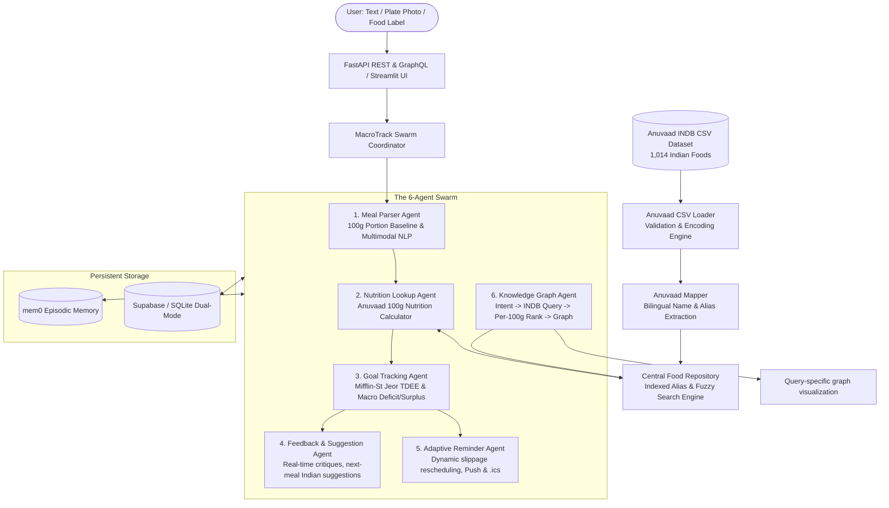

# MacroTrack: Multi-Agent Clinical Nutrition Tracking System

MacroTrack is a multimodal, multi-agent clinical nutrition tracking and coaching system tailored for Indian diets, powered by **Gemini 3.5 Flash**, **mem0** episodic memory, the **Anuvaad INDB Dataset** (1,014 Indian Foods & Recipes from ICMR-NIN), a query-driven nutrition graph, adaptive reminders, and dual REST + GraphQL APIs.

---

## 🌟 Key Architecture & Data Layer



---

## 🥗 The Anuvaad INDB Dataset & 100g Standard Baseline

1. **Primary & Only Food Dataset**:
   - Stored in [`data/Anuvaad_INDB_2024.11.csv`](file:///C:/Users/chira/.gemini/antigravity/scratch/macrotrack/data/Anuvaad_INDB_2024.11.csv).
   - Contains 1,014 curated Indian foods and regional recipes with exact values for:
     - `energy_kcal`, `carb_g`, `protein_g`, `fat_g`, `fibre_g`, `calcium_mg`, `iron_mg`, `sodium_mg`, `potassium_mg`, `vitc_mg`, `freesugar_g`.
2. **100g Portion Baseline**:
   - All nutritional calculations compute macros based on standard 100g food increments or user-specified grammage.
3. **No Hallucinations / Safe Missing-Item Handling**:
   - If an item is not found in the Anuvaad dataset, MacroTrack does not fabricate random numbers.
    - It returns: *"I'm sorry, that food is not available in the INDB dataset."*
    - Multiple reliable matches are returned as selectable INDB records; unresolved foods are never logged or assigned nutrition values.

---

## 🚀 Quick Start

### 1. Launch Streamlit UI
```bash
streamlit run src/ui/dashboard.py
```
*or via launcher:*
```bash
python run_dashboard.py
```
- Interactive Multimodal Logger
- Daily & Weekly Macro Rings
- Nutrition Knowledge Graph Explorer
- Adaptive Meal Reminder Timeline
- Anuvaad Food Database Search Browser (1,014 foods)

### 2. Launch FastAPI Server (REST + GraphQL)
```bash
python run_server.py
```
- Interactive Swagger UI: `http://localhost:8000/docs`
- Interactive GraphQL Explorer: `http://localhost:8000/graphql`
- Food Search Endpoint: `GET /api/foods/search?query=paneer`

### 3. Run Automated Tests
```bash
python -m pytest tests/ -v
```
